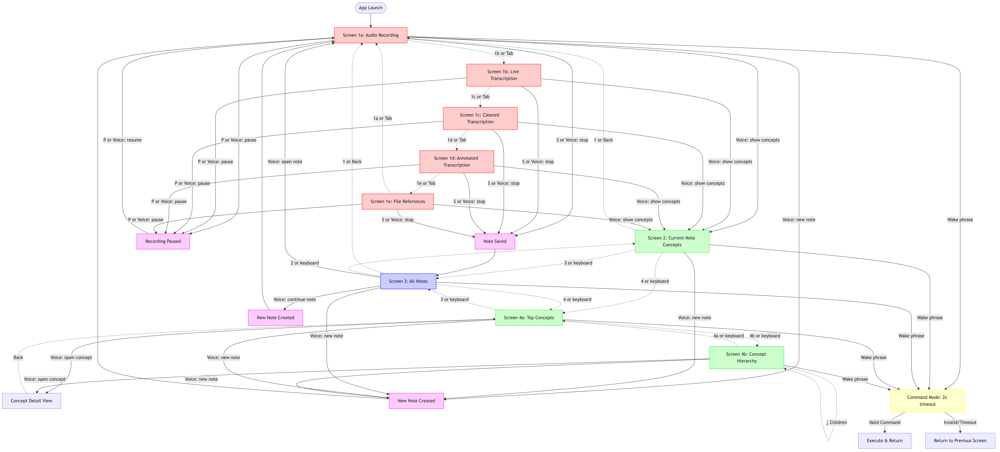

# Listen 2 Me: An LLM-powered notetaking & idea organizer app

## Executive Summary

Listen 2 Me is a hands-free, voice-controlled note-taking application that captures and organizes ideas in real-time. The app uses continuous voice recording with AI-powered transcription to extract key concepts as you speak, making it ideal for capturing thoughts while driving, walking, or in any hands-free scenario. Unlike traditional note-taking apps, Listen 2 Me is designed for noisy environments and maintains context through pauses, creating a seamless thought-capture experience.

**Core Value Proposition:** Transform scattered thoughts into organized, searchable knowledge without interrupting your flow or requiring manual input.

## Platform & Scope

* Target platform: Python terminal app (initial implementation)
* Future platforms: MacOS desktop app, then Android app (long-term goal)
* Hands-free mode is primary. Typing mode is secondary.
* Voice controlled & activated. Voice interface is primary.
* Should work in noisy environments, e.g. driving with AC on, walking around with a dog, etc.
* Should be in a "continuous listening" mode. Once activated, it should be resilient to pauses as I think. It should ideally be resilient to other noise, including other people speaking. 

## Technical Requirements

### Performance Requirements
* Real-time transcription with <2 second latency
* Minimum 15 minutes continuous recording without interruption
* Efficient resource usage for extended recording sessions
* Works offline for basic recording (transcription can be processed later)

### Audio Requirements
* Basic noise filtering for common environments (office, home)
* Voice activity detection to distinguish user speech from background noise
* Support for built-in microphone and external audio devices
* Automatic gain control for consistent audio levels

### Platform Requirements
* Python 3.8+
* Cross-platform compatibility (MacOS, Linux, Windows)
* Basic terminal interface with text-based output
* Microphone access via Python audio libraries (pyaudio, sounddevice)
* Internet connection for AI processing (optional for basic recording)
* File-based data storage (JSON/SQLite)

## Core Workflow
    * When started, it goes straight to note capturing mode. The entire conversation is always recorded, RAW, so it can be replayed later if needed.
    * As capture happens, real-time transcription is occurring. 
    * The transcription will be creating a "real-time summary" of key concepts in the note. These should be short descriptions that can fit on a phone screen single line. Every time a new "key concept" is generated, it gets added to the list. This can happen every 10-30s or so.
    * The transcription should be annotated with what "key concepts" are touched upon in that part of the conversation. Later, when the transcription is saved, it should be saved with these annotations. This will be a key part of our data structured.
    * As more capture happens, the "key concepts" previously generated and full conversation is included. *Key concepts* should be reused whenever possible. If a new key concept is applied, it should have a timestamp of when it shows up.

## Data Structures

### Note Structure (Immutable with File-Based Storage)
```json
{
  "id": "uuid",
  "timestamp": "2024-01-01T12:00:00Z",
  "title": "Auto-generated or user-provided title",
  "status": "recording|processing|completed",
  "duration_seconds": 1800,
  "file_references": {
    "audio_files": [
      "audio/2024/01/2024-01-01T12-00-00Z_001.wav",
      "audio/2024/01/2024-01-01T12-15-30Z_002.wav"
    ],
    "raw_transcription": "transcriptions/raw/2024-01-01T12-00-00Z.json",
    "cleaned_transcription": "transcriptions/cleaned/2024-01-01T12-00-00Z.json", 
    "annotated_transcription": "transcriptions/annotated/2024-01-01T12-00-00Z.json"
  },
  "relationships": {
    "parent_note": "note_id_parent",
    "child_notes": ["note_id_child1", "note_id_child2"],
    "related_notes": ["note_id_related1"],
    "continuation_of": "note_id_previous"
  },
  "key_concepts": ["concept_id_1", "concept_id_2", "concept_id_3"],
  "immutable": true
}
```

### Note Continuation Strategy
**Core Principle:** Notes are immutable once completed. No editing or resuming allowed.

**Continuation Workflow:**
1. **User wants to continue**: Voice command "Listen 2 Me, continue previous note" 
2. **New note creation**: App creates a completely new note with `continuation_of` link
3. **Context preservation**: New note inherits key concepts from previous note for LLM context
4. **Linking**: Previous note gets updated with new note ID in `child_notes` array
5. **Display**: UI shows linked notes as a thread/conversation

**Benefits:**
- **Data integrity**: Original recordings never modified
- **Audit trail**: Complete history of all changes and additions
- **Parallel processing**: Multiple people can work on related topics simultaneously
- **Recovery**: Can always go back to any previous state
```

### Hierarchical Key Concept Structure
```json
{
  "id": "uuid",
  "name": "Short concept name",
  "description": "Brief description fitting on one line",
  "first_mentioned": "2024-01-01T12:05:30Z",
  "last_mentioned": "2024-01-01T12:15:45Z",
  "mention_count": 3,
  "weight": 0.85,
  "hierarchy": {
    "parent_concept": "concept_id_parent",
    "child_concepts": ["concept_id_child1", "concept_id_child2"],
    "level": 2,
    "path": "Engineering/Software/Quality"
  },
  "relationships": {
    "related_concepts": ["concept_id_4", "concept_id_5"],
    "synonyms": ["concept_id_alt1"],
    "antonyms": ["concept_id_opposite"]
  },
  "notes": ["note_id_1", "note_id_2"],
  "markdown_file": "concepts/engineering/software/quality.md"
}
```

### Implementation Data Structures

**Note:** The JSON structures above are for documentation. In implementation, use more efficient formats:

#### 3-Version Transcription Matrices
```python
# Raw Transcription Matrix
RAW_SEGMENT_ID = 0
RAW_TEXT = 1
RAW_START_TIME = 2
RAW_END_TIME = 3
RAW_CONFIDENCE = 4
RAW_SERVICE = 5

raw_transcription = [
    ["seg_001", "um so like we need to uh think about the project planning you know", 0.0, 5.2, 0.95, "whisper"],
    ["seg_002", "and then there's the budget stuff we gotta figure out", 5.2, 8.7, 0.89, "whisper"]
]

# Cleaned Transcription Matrix
CLEAN_SEGMENT_ID = 0
CLEAN_TEXT = 1
CLEAN_START_TIME = 2
CLEAN_END_TIME = 3
CLEAN_CONFIDENCE = 4
CLEAN_SOURCE_SEGMENTS = 5
CLEAN_PROCESSING_TIME = 6
CLEAN_LLM_SERVICE = 7

cleaned_transcription = [
    ["clean_001", "We need to think about the project planning.", 0.0, 5.2, 0.95, ["seg_001"], "2024-01-01T12:00:10Z", "claude"],
    ["clean_002", "Then there's the budget we need to figure out.", 5.2, 8.7, 0.89, ["seg_002"], "2024-01-01T12:00:15Z", "claude"]
]

# Annotated Transcription Matrix  
ANNO_SEGMENT_ID = 0
ANNO_TEXT = 1
ANNO_START_TIME = 2
ANNO_END_TIME = 3
ANNO_CONFIDENCE = 4
ANNO_SOURCE_SEGMENTS = 5
ANNO_KEY_CONCEPTS = 6
ANNO_PROCESSING_TIME = 7
ANNO_LLM_SERVICE = 8

annotated_transcription = [
    ["anno_001", "We need to think about the project planning.", 0.0, 5.2, 0.95, ["clean_001"], ["concept_id_1", "concept_id_2"], "2024-01-01T12:00:20Z", "gpt-4"],
    ["anno_002", "Then there's the budget we need to figure out.", 5.2, 8.7, 0.89, ["clean_002"], ["concept_id_3"], "2024-01-01T12:00:25Z", "gpt-4"]
]
```

### Storage Strategy

#### Git + Markdown Primary Storage
The primary source of truth will be human-readable Markdown files stored in a Git repository:

```
listen-2-me-data/
├── notes/
│   ├── 2024/
│   │   ├── 01/
│   │   │   ├── 2024-01-15T10-30-00Z-project-planning.md
│   │   │   └── 2024-01-15T14-22-00Z-budget-discussion.md
│   │   └── 02/
│   └── templates/
├── concepts/
│   ├── engineering/
│   │   ├── software/
│   │   │   ├── quality.md
│   │   │   └── design-patterns.md
│   │   └── engineering.md
│   └── business/
│       ├── project-management.md
│       └── budgeting.md
├── audio/
│   ├── 2024/
│   │   └── 01/
│   │       ├── 2024-01-15T10-30-00Z_001.wav
│   │       ├── 2024-01-15T10-30-00Z_002.wav
│   │       └── 2024-01-15T14-22-00Z_001.wav
├── transcriptions/
│   ├── raw/
│   │   ├── 2024-01-15T10-30-00Z.json
│   │   └── 2024-01-15T14-22-00Z.json
│   ├── cleaned/
│   │   ├── 2024-01-15T10-30-00Z.json
│   │   └── 2024-01-15T14-22-00Z.json
│   └── annotated/
│       ├── 2024-01-15T10-30-00Z.json
│       └── 2024-01-15T14-22-00Z.json
└── .listen2me/
    ├── index.db          # SQLite for fast searching
    ├── cache/            # Processed DataFrames
    └── config.json       # App settings
```

#### Markdown File Structure

**Note Files:**
```markdown
# Project Planning Discussion
*Created: 2024-01-15T10:30:00Z*
*Duration: 18m 45s*
*Status: completed*
*Immutable: true*

## File References
- **Audio Files:**
  - [../audio/2024/01/2024-01-15T10-30-00Z_001.wav](../audio/2024/01/2024-01-15T10-30-00Z_001.wav)
  - [../audio/2024/01/2024-01-15T10-30-00Z_002.wav](../audio/2024/01/2024-01-15T10-30-00Z_002.wav)
- **Raw Transcription:** [../transcriptions/raw/2024-01-15T10-30-00Z.json](../transcriptions/raw/2024-01-15T10-30-00Z.json)
- **Cleaned Transcription:** [../transcriptions/cleaned/2024-01-15T10-30-00Z.json](../transcriptions/cleaned/2024-01-15T10-30-00Z.json)
- **Annotated Transcription:** [../transcriptions/annotated/2024-01-15T10-30-00Z.json](../transcriptions/annotated/2024-01-15T10-30-00Z.json)

## Relationships
- **Continuation of:** [Morning Standup](2024-01-15T09-00-00Z-morning-standup.md)
- **Continued by:** [Planning Follow-up](2024-01-15T16-00-00Z-planning-followup.md)
- **Related Notes:** [Budget Discussion](2024-01-15T14-22-00Z-budget-discussion.md)

## Key Concepts
- [Project Management](../../concepts/business/project-management.md)
- [Software Quality](../../concepts/engineering/software/quality.md)
- [Budgeting](../../concepts/business/budgeting.md)

## Transcription
### 10:30:15 - Project Management
We need to think about the project planning. The timeline is getting tight and we should probably start documenting our approach.

### 10:32:30 - Software Quality  
The quality aspects are really important here. We can't just rush through this without proper testing.
```

**Concept Files:**
```markdown
# Project Management
*Path: business/project-management*
*Created: 2024-01-15T10:30:00Z*
*Last Updated: 2024-01-15T14:22:00Z*

## Description
Planning and organizing projects from inception to completion.

## Hierarchy
- **Parent:** [Business](../business.md)
- **Children:** 
  - [Agile Management](agile-management.md)
  - [Timeline Planning](timeline-planning.md)

## Related Concepts
- [Software Quality](../engineering/software/quality.md)
- [Budgeting](budgeting.md)

## Notes
- [Project Planning Discussion](../../notes/2024/01/2024-01-15-project-planning.md)
- [Sprint Review](../../notes/2024/01/2024-01-20-sprint-review.md)

## Statistics
- **First Mentioned:** 2024-01-15T10:30:00Z
- **Total Mentions:** 12
- **Weight:** 0.85
```

#### Runtime Storage
* **Processing Cache**: Pandas DataFrames saved as Parquet in `.listen2me/cache/`
* **Search Index**: SQLite database for fast concept/note relationships
* **Audio Files**: WAV files organized by date, referenced by relative paths
* **Git Integration**: Automatic commits after each note, with review workflow via branches

#### Review Workflow
1. **Note Completion**: App processes transcription and identifies concepts
2. **Branch Creation**: Create `note-2024-01-15-project-planning` branch
3. **File Generation**: Generate Markdown files and update concept hierarchy
4. **Merge Request**: Create MR for human review of AI-generated content
5. **Merge**: After approval, merge to main branch and update search index

## User Personas & Use Cases

### Primary Persona: "The Busy Professional"
**Background:** Knowledge worker who generates many ideas throughout the day but struggles to capture them without interrupting their workflow.

**Use Cases:**
- Capturing project ideas during commute
- Recording meeting follow-ups while walking between offices
- Brainstorming solutions while exercising
- Documenting insights during focused work sessions

### Secondary Persona: "The Creative Thinker"
**Background:** Writer, designer, or entrepreneur who needs to capture creative bursts whenever they occur.

**Use Cases:**
- Recording story ideas while doing household chores
- Capturing design inspiration during nature walks
- Documenting business concepts during late-night thinking sessions
- Building upon previous ideas through voice notes

### Key Scenarios:
1. **Hands-free capture:** User is driving and wants to record project thoughts
2. **Noisy environment:** User is in a coffee shop but needs to capture an important idea
3. **Continuation:** User resumes a previous thinking session and builds on past concepts
4. **Review & organize:** User wants to find all notes related to a specific concept

## Voice Commands

### Core Commands
- **"Listen 2 Me, start recording"** - Begin a new note capture session
- **"Listen 2 Me, stop recording"** - End current recording and save note
- **"Listen 2 Me, pause"** - Temporarily pause recording (maintains session)
- **"Listen 2 Me, resume"** - Resume paused recording
- **"Listen 2 Me, new note"** - Start a completely new note (saves current if active)

### Navigation Commands
- **"Listen 2 Me, show concepts"** - Display current key concepts being tracked
- **"Listen 2 Me, open previous note"** - Load and display the last recorded note
- **"Listen 2 Me, continue previous note"** - Create new note linked to previous one
- **"Listen 2 Me, find [concept name]"** - Search for notes containing specific concept
- **"Listen 2 Me, organize mode"** - Switch to organization/review mode (future feature)

### Meta Commands
- **"Listen 2 Me, replay last"** - Play back the last 30 seconds of audio
- **"Listen 2 Me, title this [custom title]"** - Set custom title for current note
- **"Listen 2 Me, help"** - Show available commands

### Command Recognition & Mode Switching
- Commands must start with "Listen 2 Me" wake phrase
- 2-second timeout after wake phrase to execute command
- If no valid command detected, return to normal recording mode
- Commands work during recording without stopping the session

## Operating Modes

### Transcribe Mode (Default)
**Behavior:** App is in continuous listening mode, transcribing everything said
**Characteristics:**
- Very "sticky" - stays in transcribe mode to avoid interruptions
- All speech is processed as content to be transcribed
- Background noise and conversations are filtered out but user speech is captured
- Visual indicator: "🎙️ Recording..." or similar

**Entering Transcribe Mode:**
- Default mode when app starts
- Automatically returns after command execution
- Voice command: "Listen 2 Me, start recording"

### Command Mode (Temporary)
**Behavior:** App is waiting for a specific voice command
**Characteristics:**
- Triggered only by "Listen 2 Me" wake phrase
- 2-second listening window for command recognition
- If no valid command detected, returns to Transcribe Mode
- Visual indicator: "⏳ Listening for command..." or similar

**Command Mode Flow:**
1. User says "Listen 2 Me"
2. App responds with audio/visual feedback: "Command?"
3. App waits 2 seconds for valid command
4. If valid command: Execute and return to Transcribe Mode
5. If invalid/no command: Return to Transcribe Mode immediately

**Why This Design:**
- Prevents accidental command triggering during natural speech
- Ensures transcription is never interrupted unintentionally
- Clear distinction between content and control interactions
- Minimizes false positives from background conversations

## Implementation Phases

### Phase 1: "Crawl" - Basic Recording (v0.1)
**Goal:** Prove core technical feasibility with minimal viable functionality

**Features:**
- Simple Python script that records audio to WAV file
- Basic real-time transcription using Google Cloud Speech-to-Text
- Auto mode for testing and validation
- Save transcription to text file when stopped

**Success Criteria:**
- Can record 5+ minutes of continuous audio
- Transcription accuracy >80% in quiet environment
- Auto mode works reliably for testing
- Clear error messages when configuration or credentials are missing

**Broken down to 4 deliverables:**
1. Enable microphone, recording, and saving to file (with regular checkpoints in case things crash). Clean up resources when finished / crashed.
2. Auto mode with configurable duration and Google Speech transcription
3. Real-time transcription generation with Google Cloud Speech-to-Text. Basic statistics gathered, e.g. time to response.
4. Explicit error handling - app should fail clearly when credentials or configuration are missing.

### Phase 2: "Walk" -- Cleaned Up Transcription (v0.2)
**Goal:** Use AI to clean up otherwise messy transcriptions that would be hard for humans to follow directly.

**Features:**
- LLM integration (OpenAI GPT-4 and Claude) for transcription cleanup
- Auto mode with cleaned transcription output
- Batching of transcription as there is "enough" to go cleanup
- Removes filler words, formats properly, adds punctuation
- Handles long pauses
- Maps cleaned up version back to the original transcription

**Success Criteria:**
- Transcription cleanup runs continuously in auto mode
- Cleanup doesn't change the input too drastically
- Doesn't duplicate content, mix up ordering, etc.
- Mapping is roughly correct
- Clear error messages when LLM APIs fail or credentials are missing

**Broken down to 4 deliverables:**
1. LLM API integration set up to 2 providers (Claude + OpenAI). Successful request/responses processed.
2. Prompts generated for the "cleanup" phase. Explain what is being put in (raw transcription), and how we want it cleaned up, and especially that we want to maintain fidelity to the original.
3. Auto mode enhanced to show cleaned transcription results
4. Process that cleans up every 10s, or if there is an audio pause for >2s, or if the entire note is paused/saved.

### Phase 3: "Run" - Key Concept Extraction (v0.3)
**Goal:** Add AI-powered concept identification

**Features:**
- LLM integration (OpenAI GPT-4 or Claude) for concept extraction
- Auto mode with concept identification output
- Save concepts with timestamps in matrix format
- Basic concept reuse detection

**Success Criteria:**
- Identifies 3-5 relevant concepts per 10-minute session
- Concepts are human-readable and relevant
- Can reuse concepts from previous sessions
- Robust concept extraction in auto mode
- Clear error messages when concept extraction fails

**Broken down to 5 deliverables:**
1. Data structure for storing our key concepts, both global and note-specific ones.
2. Data structure for the model explaining how we want the key concepts/timestamps (or sentence indices?) identified, so that it returns data in a format that we can ingest easily.
3. Clean prompts explaining what we want from the model. Prompt should include the global "key concepts" that the app is aware of so far, as well as key-concepts already identified in this note. Then it should include the "not yet annotated" transcription, and maybe the previous ~3 "blocks" of the note (where a block is a contiguous note on the same Key Concept). 
4. Integration with 2 LLMs (Claude + OpenAI) for sending the prompts and getting the key concepts back, in the usable API format.
5. Auto mode enhanced to show concept extraction results and save the updated global concept hierarchy.

### Phase 4: "Sprint" - Interactive UI (v0.4)
**Goal:** Build user-friendly terminal interface for the proven auto flow

**Features:**
- Interactive terminal UI with real-time transcription display
- Screen 1a: Audio recording status and statistics
- Screen 1b: Real-time transcription output
- Screen 1c: Cleaned transcription display
- Screen 1d: Concept extraction visualization
- Keyboard shortcuts for navigation and control

**Success Criteria:**
- All auto mode functionality available through interactive UI
- Real-time updates during recording and transcription
- Smooth navigation between different views
- Robust error handling and user feedback

**Broken down to 4 deliverables:**
1. **Interactive main application**: Replace auto-only mode with interactive terminal UI
2. **Screen 1a implementation**: Audio recording status with real-time statistics
3. **Screen 1b implementation**: Real-time transcription display with backend comparison
4. **Screen 1c/1d implementation**: Cleaned transcription and concept extraction displays

### Phase 5: "Marathon" - Markdown + Git Integration (v0.5)
**Goal:** Save all of the notes, key concepts, and relationships in a very human-digestible, iterative format.

**Features:**
- Full Git repository integration with automatic commits
- Markdown generation for notes and concepts with proper linking
- Hierarchical file structure matching concept taxonomy
- Review workflow with branch-based changes
- Bidirectional sync: read existing Markdown files on startup
- Conflict resolution for concurrent edits

**Success Criteria:**
- All notes and concepts saved as linked Markdown files
- Git history preserves all changes with meaningful commit messages
- Human can manually edit concept files and app reads changes
- Review workflow catches AI transcription/annotation errors
- Repository can be browsed and searched independently of app

**Broken down to 6 deliverables:**
1. **Git repository setup**: Initialize repo structure, create templates, setup .gitignore
2. **Markdown generation**: Convert internal data structures to formatted Markdown with proper frontmatter and links
3. **File organization**: Implement hierarchical directory structure based on concept taxonomy
4. **Bidirectional sync**: Read existing Markdown files on startup, if requested, and blow away internal state. 
5. **Review workflow**: Branch creation, file generation, merge request creation via Git hooks

### Phase 6: "Ultra" - Full Voice Control (v0.6)
**Goal:** Complete hands-free operation

**Features:**
- Voice command recognition and execution
- Session management (start/stop/pause)
- Note organization and retrieval
- Persistent storage with SQLite indexing
- All secondary screens implemented

**Success Criteria:**
- Can navigate previous notes using voice only
- Data persists across sessions and can be searched

## Voice Transcription Service Research

### Option 1: OpenAI Whisper
**Pros:**
- High accuracy across multiple languages
- Runs locally (no internet required after download)
- Free and open source
- Good performance on noisy audio
- Real-time capable with optimizations

**Cons:**
- Requires significant local compute (GPU recommended)
- Initial model download ~1GB
- Latency can be 2-5 seconds for real-time processing
- Resource intensive for continuous operation

**Integration:** `openai-whisper` Python package, local model inference

### Option 2: Google Cloud Speech-to-Text
**Pros:**
- Excellent accuracy and speed (<1 second latency)
- Automatic punctuation and formatting
- Streaming real-time transcription
- Handles multiple speakers
- Good noise cancellation

**Cons:**
- Requires internet connection
- Costs ~$0.006 per 15 seconds of audio
- Data sent to Google servers
- API rate limits

**Integration:** `google-cloud-speech` Python package, streaming API

### Option 3: Azure Cognitive Services Speech
**Pros:**
- Very fast real-time transcription
- Custom vocabulary support
- Good accuracy in noisy environments
- Automatic language detection
- Reasonable pricing

**Cons:**
- Requires internet connection
- Costs ~$1 per hour of audio
- Microsoft ecosystem dependency
- Less established than alternatives

**Integration:** `azure-cognitiveservices-speech` Python package

### Recommendation
**Phase 1:** Start with OpenAI Whisper for offline capability and cost-effectiveness
**Phase 2:** Add Google Cloud Speech as comparison option for speed/accuracy testing
**Phase 3:** Implement hybrid approach - Whisper for offline, Google Cloud for online with better performance

## UX Screen Mockups

### Screen 1: Transcribing Screens

#### Screen 1a: Audio Recording Status
```
┌─────────────────────────────────────────────────────────────────────────────┐
│ Listen 2 Me - Recording                                       [🎙️ REC 15:23] │
├─────────────────────────────────────────────────────────────────────────────┤
│                                                                             │
│ Audio Input: ████████████████████████████████████████████████████████████   │
│             ▓▓▓▓▓▓▓▓▓▓▓▓▓▓▓▓▓▓▓▓▓▓▓▓▓▓▓▓▓▓▓▓▓▓▓▓▓▓▓▓▓▓▓▓▓▓▓▓▓▓▓▓▓▓▓▓▓▓▓▓▓▓▓▓ │
│                                                                             │
│ Status: Recording...                                                        │
│ Duration: 15:23                                                             │
│ File Size: 142.5 MB                                                        │
│ Audio Files: 3 segments                                                    │
│                                                                             │
│ Current File: 2024-01-15T10-30-00Z_003.wav                                │
│                                                                             │
├─────────────────────────────────────────────────────────────────────────────┤
│ [P] Pause  [S] Stop & Save  [N] New Note  [H] Help                        │
│ Say "Listen 2 Me" for voice commands                                       │
└─────────────────────────────────────────────────────────────────────────────┘
```

#### Screen 1b: Live Transcription
```
┌─────────────────────────────────────────────────────────────────────────────┐
│ Listen 2 Me - Live Transcription                          [🎙️ REC 15:23] │
├─────────────────────────────────────────────────────────────────────────────┤
│                                                                             │
│ Live Transcription (Whisper):                                              │
│ ┌─────────────────────────────────────────────────────────────────────────┐ │
│ │ 15:20 um so like we need to uh think about the project planning you    │ │
│ │       know and then there's the budget stuff we gotta figure out       │ │
│ │                                                                         │ │
│ │ 15:22 [processing...]                                                   │ │
│ │                                                                         │ │
│ │ 15:23 ▓ [listening...]                                                  │ │
│ └─────────────────────────────────────────────────────────────────────────┘ │
│                                                                             │
│ Service: Whisper (local)                                                   │
│ Latency: 2.3s avg                                                          │
│ Confidence: 89% avg                                                        │
│                                                                             │
├─────────────────────────────────────────────────────────────────────────────┤
│ [P] Pause  [S] Stop & Save  [R] Reprocess  [1a] Audio View               │
│ Say "Listen 2 Me" for voice commands                                       │
└─────────────────────────────────────────────────────────────────────────────┘
```

#### Screen 1c: Cleaned Transcription
```
┌─────────────────────────────────────────────────────────────────────────────┐
│ Listen 2 Me - Cleaned Transcription                       [🎙️ REC 15:23] │
├─────────────────────────────────────────────────────────────────────────────┤
│                                                                             │
│ Cleaned Transcription (Claude):                                            │
│ ┌─────────────────────────────────────────────────────────────────────────┐ │
│ │ 15:20 We need to think about the project planning. Then there's the    │ │
│ │       budget we need to figure out.                                    │ │
│ │                                                                         │ │
│ │ 15:22 [processing batch...]                                             │ │
│ │                                                                         │ │
│ │ 15:23 [waiting for pause or 10s interval...]                           │ │
│ └─────────────────────────────────────────────────────────────────────────┘ │
│                                                                             │
│ Service: Claude (API)                                                      │
│ Batch Size: 127 words                                                      │
│ Processing: Every 10s or on pause                                          │
│                                                                             │
├─────────────────────────────────────────────────────────────────────────────┤
│ [P] Pause  [S] Stop & Save  [R] Reprocess  [1b] Raw View                 │
│ Say "Listen 2 Me" for voice commands                                       │
└─────────────────────────────────────────────────────────────────────────────┘
```

#### Screen 1d: Annotated Transcription
```
┌─────────────────────────────────────────────────────────────────────────────┐
│ Listen 2 Me - Annotated Transcription                     [🎙️ REC 15:23] │
├─────────────────────────────────────────────────────────────────────────────┤
│                                                                             │
│ Annotated Transcription (GPT-4):                                           │
│ ┌─────────────────────────────────────────────────────────────────────────┐ │
│ │ 15:20 We need to think about the project planning. Then there's the    │ │
│ │       budget we need to figure out.                                    │ │
│ │       [Project Management] [Budgeting]                                  │ │
│ │                                                                         │ │
│ │ 15:22 [processing concepts...]                                          │ │
│ │                                                                         │ │
│ │ 15:23 [waiting for cleaned transcription...]                           │ │
│ └─────────────────────────────────────────────────────────────────────────┘ │
│                                                                             │
│ Service: GPT-4 (API)                                                       │
│ Concepts Found: 2 new, 1 reused                                           │
│ Global Concepts: 47 total                                                  │
│                                                                             │
├─────────────────────────────────────────────────────────────────────────────┤
│ [P] Pause  [S] Stop & Save  [R] Reprocess  [1c] Cleaned View             │
│ Say "Listen 2 Me" for voice commands                                       │
└─────────────────────────────────────────────────────────────────────────────┘
```

#### Screen 1e: File References
```
┌─────────────────────────────────────────────────────────────────────────────┐
│ Listen 2 Me - File References                             [🎙️ REC 15:23] │
├─────────────────────────────────────────────────────────────────────────────┤
│                                                                             │
│ Audio Files:                                                               │
│ ┌─────────────────────────────────────────────────────────────────────────┐ │
│ │ 📁 2024-01-15T10-30-00Z_001.wav    [0:00-5:30]    52.3 MB    ✓ saved  │ │
│ │ 📁 2024-01-15T10-30-00Z_002.wav    [5:30-12:15]   73.1 MB    ✓ saved  │ │
│ │ 📁 2024-01-15T10-30-00Z_003.wav    [12:15-15:23]  42.7 MB    🔄 rec   │ │
│ └─────────────────────────────────────────────────────────────────────────┘ │
│                                                                             │
│ Transcription Files:                                                       │
│ ┌─────────────────────────────────────────────────────────────────────────┐ │
│ │ 📄 raw/2024-01-15T10-30-00Z.json                          ⏳ pending    │ │
│ │ 📄 cleaned/2024-01-15T10-30-00Z.json                      ⏳ pending    │ │
│ │ 📄 annotated/2024-01-15T10-30-00Z.json                    ⏳ pending    │ │
│ └─────────────────────────────────────────────────────────────────────────┘ │
│                                                                             │
│ Total Storage: 168.1 MB                                                    │
│                                                                             │
├─────────────────────────────────────────────────────────────────────────────┤
│ [P] Pause  [S] Stop & Save  [R] Reprocess All  [1a] Audio View           │
│ Say "Listen 2 Me" for voice commands                                       │
└─────────────────────────────────────────────────────────────────────────────┘
```

### Screen 2: Current Note Key Concepts
```
┌─────────────────────────────────────────────────────────────────────────────┐
│ Listen 2 Me - Current Note Concepts                                        │
├─────────────────────────────────────────────────────────────────────────────┤
│                                                                             │
│ Key Concepts (by appearance):                                              │
│ ┌─────────────────────────────────────────────────────────────────────────┐ │
│ │                                                                         │ │
│ │  Project Management  ████████████████████████████████ 0.92  [15:20]   │ │
│ │                                                                         │ │
│ │     Budgeting       ████████████████████████████       0.78  [15:20]   │ │
│ │                                                                         │ │
│ │   Software Quality  ████████████████████████           0.65  [15:22]   │ │
│ │                                                                         │ │
│ │    Timeline         ████████████████████               0.55  [15:21]   │ │
│ │                                                                         │ │
│ │  Resource Planning  ████████████████                   0.43  [15:23]   │ │
│ │                                                                         │ │
│ └─────────────────────────────────────────────────────────────────────────┘ │
│                                                                             │
│ Note: Project Planning Discussion                                          │
│ Duration: 15:23                                                             │
│ Concepts: 5 identified, 2 reused from previous notes                      │
│                                                                             │
├─────────────────────────────────────────────────────────────────────────────┤
│ [1] Transcription  [3] All Notes  [4] All Concepts  [B] Back              │
│ Say "Listen 2 Me" for voice commands                                       │
└─────────────────────────────────────────────────────────────────────────────┘
```

### Screen 3: All Notes
```
┌─────────────────────────────────────────────────────────────────────────────┐
│ Listen 2 Me - All Notes                                                    │
├─────────────────────────────────────────────────────────────────────────────┤
│                                                                             │
│ Recent Notes:                                                              │
│ ┌─────────────────────────────────────────────────────────────────────────┐ │
│ │ #1  Project Planning Discussion                         [15:23] 2024-01-15│ │
│ │     [Project Management] [Budgeting] [Software Quality]           🔄 rec │ │
│ │                                                                         │ │
│ │ #2  Morning Standup                                     [08:45] 2024-01-15│ │
│ │     [Agile] [Sprint Planning] [Team Coordination]             ✓ complete │ │
│ │                                                                         │ │
│ │ #3  Weekend Ideas                                       [22:15] 2024-01-14│ │
│ │     [Innovation] [Side Projects] [Learning]                  ✓ complete │ │
│ │                                                                         │ │
│ │ #4  Client Call Follow-up                              [16:30] 2024-01-14│ │
│ │     [Client Management] [Requirements] [Scope]              ✓ complete │ │
│ │                                                                         │ │
│ │ #5  Architecture Review                                [14:22] 2024-01-14│ │
│ │     [System Design] [Technical Debt] [Performance]         ✓ complete │ │
│ │                                                                         │ │
│ └─────────────────────────────────────────────────────────────────────────┘ │
│                                                                             │
│ Total Notes: 47    This Week: 12    Today: 2                              │
│                                                                             │
├─────────────────────────────────────────────────────────────────────────────┤
│ [1] Transcription  [2] Concepts  [4] All Concepts  [#] Open Note          │
│ Say "Listen 2 Me, open note #3" for voice commands                        │
└─────────────────────────────────────────────────────────────────────────────┘
```

### Screen 4a: Top Key Concepts
```
┌─────────────────────────────────────────────────────────────────────────────┐
│ Listen 2 Me - Top Key Concepts                                             │
├─────────────────────────────────────────────────────────────────────────────┤
│                                                                             │
│ Most Referenced Concepts:                                                  │
│ ┌─────────────────────────────────────────────────────────────────────────┐ │
│ │ #1  Project Management                  ████████████████████ 47 mentions│ │
│ │     Planning and organizing projects from inception to completion        │ │
│ │                                                                         │ │
│ │ #2  Software Quality                    ████████████████████ 34 mentions│ │
│ │     Ensuring code meets standards and requirements                      │ │
│ │                                                                         │ │
│ │ #3  Client Management                   ████████████████████ 28 mentions│ │
│ │     Building and maintaining client relationships                       │ │
│ │                                                                         │ │
│ │ #4  System Design                       ████████████████████ 22 mentions│ │
│ │     Architectural decisions and technical planning                      │ │
│ │                                                                         │ │
│ │ #5  Budgeting                          ████████████████████ 19 mentions│ │
│ │     Financial planning and cost management                              │ │
│ │                                                                         │ │
│ └─────────────────────────────────────────────────────────────────────────┘ │
│                                                                             │
│ Total Concepts: 127    Active: 89    This Week: 23                        │
│                                                                             │
├─────────────────────────────────────────────────────────────────────────────┤
│ [3] All Notes  [4b] Hierarchy  [#] Open Concept  [S] Search               │
│ Say "Listen 2 Me, open concept #1" for voice commands                     │
└─────────────────────────────────────────────────────────────────────────────┘
```

### Screen 4b: Concept Hierarchy
```
┌─────────────────────────────────────────────────────────────────────────────┐
│ Listen 2 Me - Concept Hierarchy                                            │
├─────────────────────────────────────────────────────────────────────────────┤
│                                                                             │
│ Business/                                                                  │
│ ┌─────────────────────────────────────────────────────────────────────────┐ │
│ │ ├── Project Management          [47 mentions]                          │ │
│ │ │   ├── Agile Management        [12 mentions]                          │ │
│ │ │   ├── Timeline Planning       [8 mentions]                           │ │
│ │ │   └── Resource Planning       [5 mentions]                           │ │
│ │ │                                                                       │ │
│ │ ├── Client Management           [28 mentions]                          │ │
│ │ │   ├── Requirements Gathering  [15 mentions]                          │ │
│ │ │   └── Scope Management        [9 mentions]                           │ │
│ │ │                                                                       │ │
│ │ └── Budgeting                   [19 mentions]                          │ │
│ │     ├── Cost Estimation        [7 mentions]                           │ │
│ │     └── Financial Planning     [4 mentions]                           │ │
│ └─────────────────────────────────────────────────────────────────────────┘ │
│                                                                             │
│ Engineering/                                                               │
│ ├── Software Quality [34]  ├── System Design [22]  ├── Performance [15]    │
│                                                                             │
│ Level: 1    Path: Business/    Children: 3    Notes: 67                   │
│                                                                             │
├─────────────────────────────────────────────────────────────────────────────┤
│ [4a] Top Concepts  [↑] Parent  [↓] Children  [Enter] Expand               │
│ Say "Listen 2 Me, open engineering" for voice commands                    │
└─────────────────────────────────────────────────────────────────────────────┘
```

## UX Flow Diagram

The following diagram shows the navigation flow between screens and available commands:



**Legend:**
- **Solid arrows** (→): Voice commands or major actions
- **Dotted arrows** (-.->): Keyboard shortcuts or button clicks
- **Red boxes**: Recording/transcription screens (Screen 1a-1e)
- **Green boxes**: Concept-related screens (Screen 2, 4a, 4b)
- **Blue boxes**: Note management screens (Screen 3)
- **Yellow boxes**: Command mode
- **Purple boxes**: Temporary states

**Key Navigation Patterns:**
1. **Screen 1 (Recording)**: Cycle through 5 views with keyboard shortcuts
2. **Voice Commands**: Available from any screen, trigger command mode
3. **Global Actions**: New note, pause/resume, stop recording work everywhere
4. **Hierarchical Flow**: Concepts → Notes → Recording in logical progression

# APPENDIX
Raw notes as I work on this PRD. Do not touch this section.

**COMPLETED ITEMS (now in main PRD):**
✅ 3 versions of text transcription → "3-Version Transcription Pipeline" section
✅ Transcribe mode and command mode → "Operating Modes" section  
✅ UX screen mockups with ASCII art → "UX Screen Mockups" section
✅ Hierarchical key concepts like Wikipedia → "Hierarchical Key Concept Structure" section
✅ Markdown files stored in Git → "Git + Markdown Primary Storage" section
✅ Review flow → "Review Workflow" section
✅ Mermaid graph of UX flows → "UX Flow Diagram" section

**ALL APPENDIX ITEMS COMPLETED!** 🎉


# FUTURE WORK
Do not touch this section. Ignore it for everything we are doing right now.
* "Conversation mode" --> I should be able to have a conversation with the LLM about a concept. Save the responses from the LLM (don't re-transcribe them), but don't include any of their ideas / key concepts in the final output. All of the ideas saved should be the note taker. OK if they are repeating the ideas that the LLM had.
